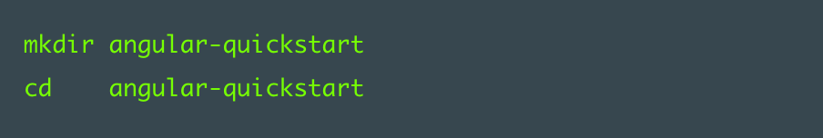
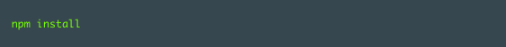
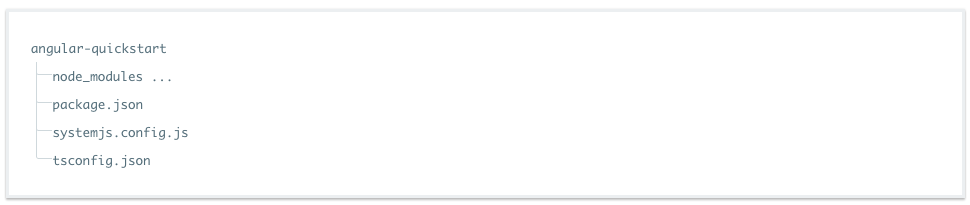
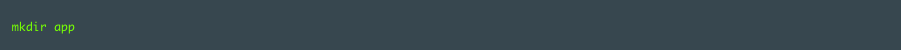
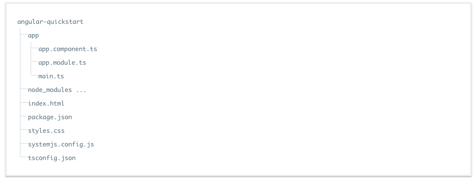

#Fori Shuruaat
#####TYPESCRIPT


Ye fori shuruaat ka page apko wazeh karay ga k kes tarah say aik sade see angular application banani or chalani hai.

#####TYPESCRIPT nahe karna chahtay?
Agarchay hum TYPESCRIPT say shuru kar rahay hain, ap angular application ko JAVASCRIPT aur DART mai bhi lik saktay hain.


Ultay hath pay deye gaye language selector ko istamal karkay ap development language tabdeel kar saktay hain


#Majmoee Jaiza


Fori Shuruaati (Quick Start) ka dhancha bilkul kese asli ANGULAR application k jaisa hai or ye application sirf aik sadah sa message dekhate hai


Is application ko chala k dekhain. Is application ki aik [zinda mesal yahan per dekhain](https://angular.io/resources/live-examples/quickstart/ts/plnkr.html)


Ap ye pori application [Github say bhi CLONE](https://github.com/angular/quickstart/blob/master/README.md) kar saktay hain. 


##Ayen application banayen!
**Shart e awal :** Node JS aur NPM install karlain
**Marhala Number 1 :** Project banayen aur usko tarteeb dain
**Marhala Number 2 :** Apni application banayen
**Marhala Number 3 :** Aik component (juz) banayen or usko apni application mai shamil karain
**Marhala Number 4 :** Apni application shuru karain (chalayen)
**Marhala Number 5 :** Aik web page wazeh karain ( banayen ) jo apki application ko host (ki mezbani ) karay
**Marhala Number 6 :** Application build karain or usko chalayen
**Marhala Number 7 :** Chalti hoi applicaiton mai kuch tabdelyan karain ( or us tabdeeli ko browser mai chalti hoi applicaiton mai dekhain )
Aglay steps ( agay k iqdamat )


##Shart e awal : Node JS aur NPM install karlain
Agar Node.js aur npm pehlay say apki machine mai nahe hain to [inko install karlain](http://blog.npmjs.org/post/85484771375/how-to-install-npm). Hamare sadah application ko chalnay k leye node v4.x.x ya us say oper ka version aur npm 3.x.x ya us say oper ka version chahye. Apni machine pay version check karnay k leye ap ye commands terminal window mai chalayen node -v aur npm -v 


**Marhala Number 1 :** Project banayen aur usko tarteeb dain
Is parhalay mai ap ye saray kam karaingay


* Project ka folder banayen
* Configuration (tarteeb e ijza) ki file banayen
* Packages ko install karain


###Project ka folder banayen

Aik terminal window ko istamal kartay hoye, is project k leye aik directory banayen, aur is directly mai chalay jayen



###Configuration (tarteeb e ijza) ki file banayen


Hamaray Angular project ko aik say ziada configuration (tarteeb e ijza) ki files chahyen.


**package.json** ye file project mai istamal hoye npm packages ki nishandahi karte hai


**tsconfig.json** ye file batate hai k TypeScript compiler kaise hamare TypeScript files ko JavaScript mai tabdeel karay ga


**systemjs.config.js** ye file module loader ko application k modules k baray mai malomat faraham karti hai or saray zarori packages ko register
 bhi karti hai. Is file mai or bhi packages ki detail mojood hai jo baad mai dosre documentation (dastaveze ) examples bhi istamal karainge.
 
 Ap ye sare files apnay project mai banayen. In filo ko nechay deye gaye text say bhar dain.
  
 
```
    This place will have the code

```

In configuration files k baray mai mazeed jannay k leye [NPM Package Configuration guide](https://angular.io/docs/ts/latest/guide/npm-packages.html) aur [TypeScript configuration guide](https://angular.io/docs/ts/latest/guide/typescript-configuration.html#tsconfig) parhlain. Is guide ka maqsad apko module loading k baray mai tafselat dena nahe hai is leye hum unsko yahan tafseel say nahe bayan kar rahay.
 
 #####System JS or Webpack
 Agarchay hum System JS (module loader) sirf samjhanay k leye istamal kar rahay hain, System JS sirf aik option hai. Ap apni marzi ka module loader istamal kar saktay hain. System JS ki jaga Web pack istamal karnay k leye, [Webpack ka tarufi document dekhain](https://angular.io/docs/ts/latest/guide/webpack.html). Agar System JS k baray mai mazeed janna hai hai to ye document dekhains.
  
###Packages install karain

Terminal ( command line ) mai jakay "npm" istamal karain, packages.json mai pehlay say mojood packages ko install karnay k leye ye command chalayen:



Shayed packages install kartay hoye (lal color mai )error messages nazar ayen ya phir npm WARN messages nazar ayen. (In messages say koi masla nahe hai). Agar apko npm ERR ! message nahe aya to samaj lain k ap nay kamyabi say packages install kar leye hain.
 
 Ab apka project structure ( project ka dhancha) aisa nazar ana chahey:
 
 

Ab ap kuch code likhnay k leye tayyar hain


##Marhala Number 2 : Apni application banayen

Ap [NgModule](https://angular.io/docs/ts/latest/guide/ngmodule.html) istamal karkay apni application ko aik dosray say mil jultay kam karnay walay hisso(modules) mai tarteeb detay hain ( tortay hain ).
Angular khud buhat say Angular modules say mil kar bani hai. Application ko chotay chotay modules mai tornay say apko application payload size chota rakhnay mai madad milti hai kyn k ap sirf Angular k wahe module import kartay hain jinki apko zarorat hoti hai.
  
  Har Angular application mai kum az kum aik module zaror hota hai jisko *root module* boltay hain. Humnay apnay root module ko **AppModule** ka naam dia hai yahan.
  
  Apnay project ki root directory mai aik "app" naam ka sub folder create karain.
  


Ab is folder mai app/app.module.ts naam ki aik file banaye or us mai nechay dia hoa code paste kardain.
 
 ```
     This place will have the code
 
 ```
 
 Ye apki application ka shuruaati (entry) point hai.
  
 Kyn k ye quickstart (Fori Shuruaati) application aik web application hai jo k browser mai chalti hai, is root module ko BrowserModule import karnay ki zarorat hai. BrowserModule @angular/platform-browser k andar mojood hai jisko hum apnay imports array mai dal dia hai. (opar code dekahin)
 
 Ye kese bhi chote tareen Angular application ko browser mai chalanay k leye kum tareen code hai.
 
 Ye quickstart (Fori Shuruaati) application is say ziada kuch nahe karte is leye apko koi or module nahe chahye. Aik asle application mai ap shayed FormsModule aur RouterModule aur HttpModule or buhat say dosray modules import karaingay. Ye saray modules [Tour of Heroes Tutorial](https://angular.io/docs/ts/latest/tutorial/) mai mojood hain.
 
 ##Marhala Number 3 : Aik component (juz) banayen or usko apni application mai shamil karain
 
  Modules ki tarah, har Angular application mai kum az kum aik component zaror hota hai jisko *root component* boltay hain. Humnay apnay root component ko **AppComponent** ka naam dia hai yahan.
  
  Components kese bhi Angular Application ka bunyade rukun hai. Koi aik component screen k aik hissay ko chalata (control karta) hai jisko component ka *view* bhi boltay hain jo k component k mutaliqa template mai mojood hota hai.
   
   
   Aik component file banayen app/app.component.ts jis mai nechay dia gaya code daldain:
  
    
    ```
        This place will have the code
    
    ```  
    
   Is quickstart (Fori Shuruaati) application ka bunyadi structure(dhancha) aisa he jaisa kese bhi dosri angular applicaiton ka hota hai.
    
   * **Aik import statement** Importing apko Angular k core(bunyadi) @Component function tak rasai faraham kar rahe hai jes ki waja say ap [@Component decorator function](https://angular.io/docs/ts/latest/api/core/index/Component-decorator.html) use kar pa rahay hain
   
   * **Aik @Component decorator** jo k apkay deye hoye *meta data* ko AppComponent class say jor raha hai. 
    
        - aik 'selector' property jo k is HTML element k leye aik sedha sa CSS selector wazeh kar rahe hai. (Ap is component ko istamal karnay k leye apnay HTML mai yahe selector istamal karaingay
        
        - aik 'template' property jo k Angular ko ye batate hai k component k view mai kia dekhana hai
        
   * **Aik component class** jo k kese component ki template mai de hoi shakal or uska tarz e amal batate hai (k ye component kese chalay ga or kia kia kar sakta hai). Yahan mai apkay pas sirf aik *root component* hai *AppComponent*. Kyn k hamare is applicaiton mai koi logic nahe hai, ese waja say hamara ye component khali hai, is mai koi code nahe hai.
     
     
   Ab ap app/app.module.ts file ko tabdeel karain or us mai AppComponent ko import karain or AppComponent ko *declaration* or *bootstrap* ki field mai dalain NgModule decorator k andar. Nechay code dekain:
    
       ```
           This place will have the code
       
       ```  
   
   ##Marhala Number 4 : Apni application shuru karain (chalayen)
     
   Ab apko Angular ko batana hai k mere application chalao.
   
   Aik file banayen app/main.ts or is mai nechay dia hoa code dal dain:
   
     ```
              This place will have the code
          
     ```  
   
   Ye code apki application k chalnay k leye platform ko shuru karay ge, or phir is platform ko istamal kartay hoye AppModule ko chalaye ge.
    
   ##### Hum kyn alag alag main.ts, app module or app component file banayen?
    
   App ko shuru karna (chalana) aur App module banana ya phir app ka koi view dekahan, ye sab alag alag chezain hain ese leye humnay in sabko alag alag files mai rakha hai.  Mazed ye k is say application testing mai bhi asani hote hai kyn k hum pori application k har har hissa aik sath nahe chala rahay hotay.
    
   ###### Bootstrapping (Application chalana) har platform k leye maksos hai
   
   Kyn k ye quickstart (Fori Shuruaati) application sedhe browser mai chalte hai, main.ts file platformBrowserDynamic function @angular/core say nahe @angular/platform-browser-dynamic say import kar rahe hai. Agar ye koi Angular ki mobile device application hote to ap [Apache Cordova](https://cordova.apache.org/) ya [NativeScript](https://www.nativescript.org/) say ye module load kar rahay hotay or aisa function import kartay jo *mobile* platform k leye maksos hai.
    
   ##Marhala Number 5 : Aik web page wazeh karain ( banayen ) jo apki application ko host (ki mezbani ) karay
    
   Project k root folder mai aik index.html file banaten or us mai nechay de gayi lines paste kardain:
   
    ```
                 This place will have the code
             
    ```  
   
   Is file mai khas batain mandarja-zail hain:
   
   * **JavaScript Libraries** : core-js polyfil puranay browser pay angular ka code chalanay k leye hai, zone.js aur reflect-metadata Angular ka engine khud use karta hai so angular ko chalay k leye in dono file ki zarorat hai aur SystemJS library module loading k leye hai. 
   * **Configuration files** : Ye file SystemJS istamal karta hai application k modules k baray mai jannay or phir isko load karnay k leye. Ye script saray modules import karte hai or phir *app* module ko run karte hai jokay hum nay *main.ts* file mai likha tha. 
   * **<my-app> tag** : ye tag <body> tag k andar hai jis mai apki pori application load hote hai. ( Ye tag wahe *selector* property hai jo apnay *app.component.ts* mai mutarif karai thi.
   
   #### Ayen kuch istayel shamil karain
   
   CSS Style zarori nahe hain lekin vo application ki khobsorti k leye achay hain. *index.html* mai pehlay say aik *style.css* file ka reference mojood hai so *index.html* ka khayal hai apnay ye style sheet file banali hai ya apkay project mai pehlay say mojod hai.
    
   Project k root par aik style.css file banayen or application ko style karna shuru kardain, shayed abhi is application k leye sirf thori se styling he kafi hoge. Nechay dia gaya code apni style.css mai daldain:
    
    ```
                    This place will have the code
                
    ```  
   
   Documentation samples(namono) k sare examples mai use honay wali mukammal style sheet k keye [styles.css](https://github.com/angular/angular.io/blob/master/public/docs/_examples/_boilerplate/styles.css) file ko dekhain. 
   
   ##Marhala Number 6 : Application build karain or usko chalayen
   
   Aik terminal window kholain or ye likhain:
      


   Ye command 2 node process aik sath chala day ge:
    
   * Aik TypeScript compiler chalayen ge *watch* mode mai jo sare files k dekhta rahay (or jesay he koi file tabdeel hoge usko dubara compile karday ga)
   * Aik static server jiska naam *lite-server* hai usko chalayega jo k index.html ko aik browser mai load karay ga or jab bhi application ki kese file mai koi tabdeeli ayegye forun browser ko refresh karday ga (takay naee tabdeel files browser mai nazar asakay)
    
   Kuch he lamho mai aik browser tab khud say khulay ga or us mai apko ye nazar ana chahye:
   

 
 ##Marhala Number 7 : Chalti hoi applicaiton mai kuch tabdelyan karain ( or us tabdeeli ko browser mai chalti hoi applicaiton mai dekhain ) Aglay steps ( agay k iqdamat )
 
 app/app.component.ts kholain or *message* ko tabdeel karni ki koshish karain. *message* ko tabdeel karkay k "My SECOND Angular App" kardain.
 
 TypeScript compiler or lite-server apki tabdeeli ka pata laga laingay, duabara say apki TypeScript ko JavaScript mai compile karaingay, browser ko refresh karaingay or naya *message* dekha daingay.
 
 Jab ap ye sab karlain or application say khail lain to compiler or server dono ko band karnay k leye terminal window ko band kardain.
 
 ##Akhri baat (Marahil e Malfof) or agay k marahil:
 
 Hatmi quickstart (Fori Shuruaati) application ka structure (dhancha) kuch aisa hona chahye:
 


 File k andar ( file ka mawad) dekhnay k leye [zinda mesal yahan per dekhain](https://angular.io/resources/live-examples/quickstart/ts/plnkr.html).
 
 ## Agay kia karna hai?
 
 Ye pehli application kuch ziada nahe karte. Ye dar asal Angualr ki "hello world" appliacation hai.
 
 Ap nay aik chota say Angular component likha, aik sedhe se index.html file banai or is ko aik statis server k zarye launch kardia.
 
 Ap nay aik sedha say application setup bhi banaya jo k ap dubara bhi istamal koro gay is guide k dosray hisso mai. Is k baad jo bhi tabdeeli ap *package.json* file ya *index.html* mai karo gay vo buhat mamoli see tabdeeli hoge ya to koi library ko update karnay k leye ya phir kese css stylesheet ko update karnay k leye. Mazeed ye k apko phir dubara module loading ko nahe chona paray ga ( Ye aik baar ka module loading ka setup complex applications k leye bhi kafi hai)
 
 Agay barhnay k leye or Angular mai aik choti se lekin asli application banany k leye [Tour of Heroes tutorial](https://angular.io/docs/ts/latest/tutorial) pay jayen.
 
 